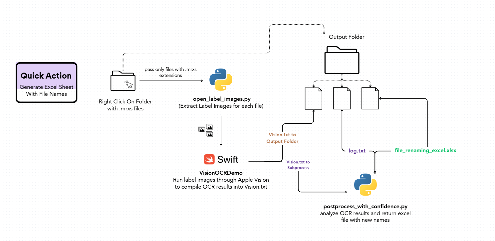

## Image Renaming Quick Action
A project created by two Bioinformatics undergraduate students at UCSD in Spring 2025 to support histopathology workflows at Glintlab.

## Table of Contents
- Overview
- Requirements
- Installation
- Usage
- Workflow Diagram
- Pipeline Components
- Input Files
- Output Files
- Script Details
- Future Directions

## Overview
This project aims to automate the process of naming computerized slide image files in a histopathology lab setting, leveraging macOS Quick Actions and Apple Vision OCR to provide an accurate and user-friendly renaming workflow.

## Requirements
- **System:** macOS 10.4 (Tiger) or later (Automator Quick Actions are stable from this version onward)
- **Developer tools:** Xcode (latest version recommended), Swift 5.3+ (tested with 6.0.3)
- **Python Dependencies:** openslide-python, openslide-bin, pandas, openpyxl

### Testing Environment
To replicate the team's conda environment used for testing, download miniconda and run these commands: <br>
`conda create -n ocrenv python=3.11 notebook ipykernel` <br>
`pip install openslide-python openslide-bin pandas openpyxl` <br>

## Installation
Follow the steps below to install and configure the Quick Action on macOS.

### 1. Clone or Download the Repository
Download all files from this repository and place them in an accessible directory on your local machine.

### 2. Build the Swift Binary
The Swift executable is located in the `VisionOCRDemo/` directory.

#### Steps:
1. Open Terminal.
2. Navigate to the **parent directory** of `VisionOCRDemo/`.
3. Run the following command to build the project in release mode:
   ```bash
   swift build -c release
4. If you encounter any issues during the build process, try cleaning and rebuilding:
   ```swift package clean
   rm -rf .build
   swift build -c release

The compiled binary will be located at:
`./.build/release/VisionOCRDemo`

### 3. Create the [] Quick Action in Automator
1. Open the Automator app and choose Quick Action as document type.
2. Set the following options at the top: []
3. Add a Run Shell Script block.
4. Paste the contents of the provided `quick_action_driver.sh` file into the block.

Note: Quick Actions are saved in ~/Library/Services and can be managed or edited by opening them directly in the Automator app.

### 4. Update Script Path Variables

Inside the `Run Shell Script` block in Automator, update the following variables in `quick_action_driver.sh` to match your local file paths:

| Variable         | Description                                                       | Example Path                                                      |
|------------------|-------------------------------------------------------------------|--------------------------------------------------------------------|
| `EXTRACT_IMAGES` | Path to the Python script that extracts images                    | `/Users/yourname/path/to/open_label_images.py`                     |
| `RUN_OCR`        | Path to the **compiled Swift binary** (`VisionOCRDemo`)           | `/Users/yourname/path/to/.build/release/VisionOCRDemo`            |
| `RENAME_FILES`   | Path to the Python script for renaming files based on OCR results | `/Users/yourname/path/to/file_renaming_outliers_excel.py`         |
| `TEMP_PATH`      | Path to a temporary folder used for intermediate file conversion  | `/Users/yourname/tmp_folder`                                      |

### [In progress]
### 5. Define a new Quick Action in Automator named [].
### 6. Like before, add a Run Shell Script block and paste the contents of *[]*


## Usage
1. Navigate to your desired folder of .mrxs images
2. Left click on folder and select Quick Actions: Rename
3. Expected output should be included into a timestamped sub-folder containing versions of the following files:
   > Vision_OCR.txt
   
   > Log.txt
   
   > file_renaming_excel.xlsx

## Workflow Diagram
[workflow diagram to be inserted]


## Input Files
The following files are required to execute our image renaming pipeline:
- *quick_action_driver.sh*: main driver script in Automator which accesses the following scripts to generate an end-to-end workflow
- *open_label_images.py*: Python script which takes in a folder of mrxs images and extracts label images as pngs into a designated output folder 
- *VisionOCRDemo/*: Swift package which performs OCR on a folder of png images and reports the text and confidence scores of extracted fields for each image
- *file_renaming_outliers_excel.py*: Python script which takes a text file of OCR results and a folder of label images and parses it into a human-readable excel sheet with the following columns:

## Output Files
- *ocr_results.txt*: a text file containing the text and confidence scores of extracted fields for each image from OCR
- *rename_log.txt*: an output log which tracks the previous and new name of each file renamed in the folder
- *expanded_ocr_results.xlsx*: an excel spreadsheet of the following format:
   
## Script Details
Note: helpful to run scripts individually for debugging purposes

open_label_images.py
Usage:

python open_label_images.py --input /path/to/mrxs_folder --output /path/to/label_output
Arguments:

--input: Path to folder containing .mrxs images.
--output: Path to save extracted label images as .png

add other files

## Future Directions

